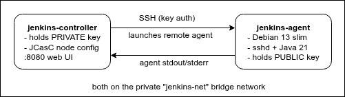

# Jenkins controller with Debian 13 agents 

A self-contained Docker setup that brings up a **Jenkins controller** and four
**Debian 13 slim build agents**, with the controller connecting to the agents
**over SSH**. The whole thing — admin user, SSH credentials, and the agent nodes
— is configured automatically via **Jenkins Configuration as Code (JCasC)**, so
there's nothing to set up after running `docker compose up -d`.

## How the SSH connection works

The Jenkins SSH launcher works **controller → agent**: the controller opens an
SSH session into the agent, copies the `remoting.jar` across, and starts the
agent JVM. That means:

- The **agent** runs an SSH server and holds the **public** key in
  `authorized_keys` (baked into the image).
- The **controller** holds the **private** key (given to it as a Docker secret)
  and a Jenkins "SSH Username with private key" credential built from it.
- The agent only needs **Java + sshd + a jenkins user** — nothing Jenkins-specific.




## File layout

```
jenkins-docker/
├── docker-compose.yml                  # orchestrates both containers
├── .env                                # JENKINS_ADMIN_PASSWORD
├── .gitignore                          # keeps keys/.env out of git
├── controller/
│   ├── Dockerfile                      # Jenkins LTS + plugins + JCasC
│   ├── plugins.txt                     # plugins to pre-install
│   └── casc.yaml                       # admin user, SSH credential, agent node
├── agent/
│   └── Dockerfile                      # Debian 13 slim SSH agent
├── scripts/
│   └── generate-keys.sh                # creates the SSH key pair
├── ssh-keys/                           # created in Step 1 (git-ignored)
│   ├── jenkins_agent_key               # PRIVATE  -> controller (as a secret)
│   └── jenkins_agent_key.pub           # PUBLIC   -> agent image
└── test/                               
    ├── agent_console_test.groovy       # test the agent packages from the Jenkins Script Console
    ├── agent-package-test.jenkinsfile  # test the agent packages from a declarative Jenkins Pipeline
    └── agent-ping-test.jenkinsfile     # ping each agent from a Jenkins Pipeline
```

---

## Step-by-step

### Step 1 → Generate the SSH key pair

The agent image needs the public key at build time, so do this first.

```bash
cd jenkins-docker
./scripts/generate-keys.sh
```

This writes `ssh-keys/jenkins_agent_key` (private) and
`ssh-keys/jenkins_agent_key.pub` (public). Re-running won't overwrite an
existing key.

### Step 2 → Set the admin password

Edit `.env` and change the default:

```bash
JENKINS_ADMIN_PASSWORD=your-custom-strong-password
```

### Step 3 → Build and start

```bash
docker compose build
docker compose up -d
```

Compose builds both images, creates the private network, mounts the private key
into the controller as a Docker secret, and starts both containers.

### Step 4 → Watch it come up

```bash
docker compose logs -f jenkins-controller
```

Wait until you see Jenkins finish loading the JCasC config and report it's
fully up. The controller will start trying to launch the agent automatically.

### Step 5 → Log in and verify the agent

1. Open <http://localhost:8080>
2. Log in as **admin** / *(the password from `.env`)*
3. Go to **Manage Jenkins → Nodes**. You should see **debian-agent** online.

If you'd rather check from the CLI:

```bash
docker compose logs jenkins-controller | grep -i "debian-agent\|agent"
```

### Step 6 → Run a job on the agent (optional smoke test)

Create a **Pipeline job** with this script to ping the desired agent node:

i.e.
```groovy
pipeline {
    agent none
    stages {
        stage('Hello from Debian Agent 1') {
            agent { label 'debian-agent-1' }
            steps {
                sh 'echo "Running on: `hostname`"; uname -a; cat /etc/os-release | head -1; java -version'
            }
        }
        stage('Hello from Debian Agent 2') {
            agent { label 'debian-agent-2' }
            steps {
                sh 'echo "Running on: `hostname`"; uname -a; cat /etc/os-release | head -1; java -version'
            }
        }
        stage('Hello from Debian Agent 3') {
            agent { label 'debian-agent-3' }
            steps {
                sh 'echo "Running on: `hostname`"; uname -a; cat /etc/os-release | head -1; java -version'
            }
        }
        stage('Hello from Debian Agent 4') {
            agent { label 'debian-agent-4' }
            steps {
                sh 'echo "Running on: `hostname`"; uname -a; cat /etc/os-release | head -1; java -version'
            }
        }
    }
}
```

Additionally, create a Pipeline job to test the packages installed on the agent:

```groovy
pipeline {
    agent any
    stages {
        stage('Agent Package Test') {
            steps {
                sh '''
                echo "Running on: `hostname`"; 
                uname -a; 
                cat /etc/os-release;
                git --version;
                java --version;
                python3 --version;
                pip3 --version;
                terraform --version
                '''
            }
        }
    }
}
```


---

## How it's wired together

| Concern | Where it's set |
|---|---|
| Agent OS / SSH server / jenkins user | `agent/Dockerfile` |
| Public key on the agent | `agent/Dockerfile` (`COPY ... authorized_keys`) |
| Private key to the controller | `docker-compose.yml` `secrets:` → `/run/secrets/jenkins_agent_private_key` |
| Jenkins credential from that key | `controller/casc.yaml` (`basicSSHUserPrivateKey`) |
| The agent node definition | `controller/casc.yaml` (`nodes: → permanent: → launcher: ssh`) |
| Controller reaching the agent | hostname `jenkins-agent` on `jenkins-net` |
| Admin login | `.env` → `JENKINS_ADMIN_PASSWORD` → `casc.yaml` |

---

## Common tweaks

- **More executors on the agent:** change `numExecutors` under the node in
  `controller/casc.yaml`.
- **More build tools in the agent** (e.g. Maven, Node, Docker CLI): add the
  `apt-get install` packages in `agent/Dockerfile`, then `docker compose build
  jenkins-agent && docker compose up -d`.
- **Add plugins:** append to `controller/plugins.txt` and rebuild the controller.
- **Use ed25519 keys instead of RSA:** edit `scripts/generate-keys.sh`
  (`-t ed25519`, drop `-b 4096`), delete `ssh-keys/`, regenerate, rebuild.

## Troubleshooting

- **Agent shows offline / "Connection refused":** the agent container may still
  be starting. Give it a moment; the launcher retries (10× by default).
- **"Auth fail" in the agent log:** the key pair is out of sync. Regenerate
  (Step 1), then **rebuild the agent** so the new public key is baked in, and
  recreate the controller so it picks up the new secret:
  `docker compose up -d --build`.
- **Changed the JCasC file but nothing changed:** reload it via **Manage
  Jenkins → Configuration as Code → Reload**, or `docker compose restart
  jenkins-controller`.
- **Reset everything:** `docker compose down -v` (the `-v` also drops the
  `jenkins_home` volume — you'll start fresh).

## Production notes

This is tuned for a local lab. Before relying on it:

- Pin explicit plugin versions in `plugins.txt`.
- Put the controller behind HTTPS / a reverse proxy and review the
  authorization strategy.
- Manage the private key with a real secrets manager rather than a file.


## References

- [Configuration as Code](https://www.jenkins.io/doc/book/managing/casc/#configuration-as-code)
  - [jenkinsci/configuration-as-code-plugin](https://github.com/jenkinsci/configuration-as-code-plugin)
- [Using Agents](https://www.jenkins.io/doc/book/using/using-agents/#using-jenkins-agents)
- [Pipeline](https://www.jenkins.io/doc/book/pipeline/)
  - [Pipeline Syntax](https://www.jenkins.io/doc/book/pipeline/syntax/#pipeline-syntax)
- [Blue Ocean](https://plugins.jenkins.io/blueocean/)
